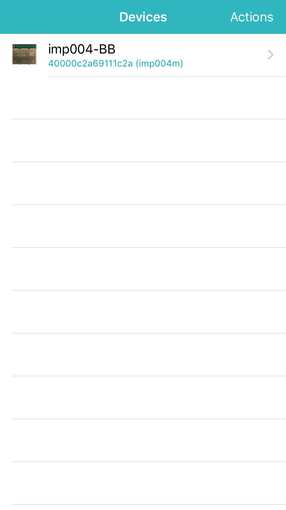
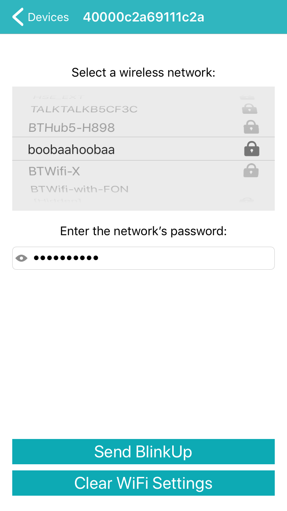
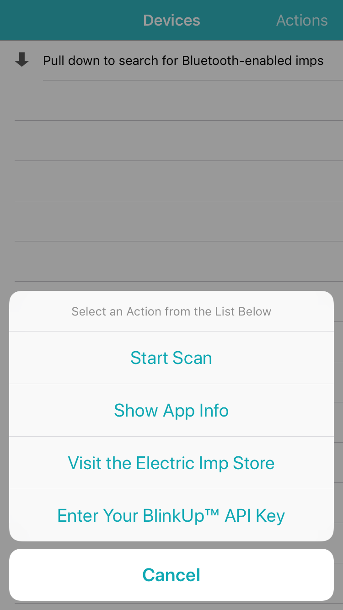
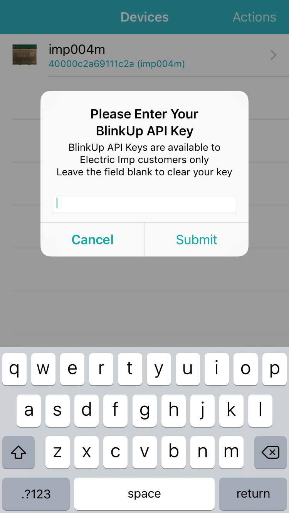

# Bluetooth BlinkUp #

This example comprises Squirrel code to run on an imp-based test device &mdash; this requires impOS™ 37 or above &mdash; and an Xcode project which you can use to build an iOS app (written in Swift) that is capable of finding and configuring test devices running the Squirrel code.

The Squirrel code provides a basic framework for supporting BlinkUp™ via Bluetooth, driven by a library class. The iOS app is used to scan for nearby Bluetooth-enabled imp-based devices, to select one of them, and then to choose a local wireless network, enter its password and transmit that information to the test device to perform BlinkUp.

The app will perform a full device activation, and this requires a BlinkUp API key, see below. It can also be used to clear a device’s WiFi settings.

**Note** The iOS code can be run in Xcode’s Device Simulator, but this will not be able to access Bluetooth. To use Bluetooth, you must run the app on a connected Apple device. This requires a Apple Developer Account.

## BlinkUp Preparation ##

The iOS app makes use of the Electric Imp BlinkUp SDK to activate a fresh production device running the included Squirrel code. As such, it requires the entry of a BlinkUp API key to authorize its access to the Electric Imp impCloud™. The app prompts the user for this key, which can also be entered (or cleared) by tapping ‘Actions’ in the navigation bar and then ‘Enter your BlinkUp™ API key’ from the menu. We recommend you copy your API key from a text file or other source, and paste it into the app.

Please note that Electric Imp makes BlinkUp API keys available **to customers only**. This sample code cannot be used by holders of free Electric Imp accounts.

Your BlinkUp API key will be stored in the iOS keychain. If you wish to clear a stored password, open the ‘Enter your BlinkUp™ API key’ panel, ensure no key is entered, and tap ‘Submit’.

Clearing the WiFi settings does not make use of the BlinkUp SDK.

## Hardware Preparation ##

When the iOS app makes use of the Electric Imp BlinkUp SDK, it performs production BlinkUp. As such, the test device **must** already have been assigned to your Electric Imp account as a development device and assigned to any Development Device Group. This Device Group can be the one you have deployed the sample Squirrel code to.

Simply setting and clearing the WiFi settings can be performed on any device running the provided Squirrel code.

## Building the App ##

In order to build the app, you will need the BlinkUp SDK. Please follow the instructions supplied with the SDK to learn how to add the SDK files to the app project. The SDK files are not included in this project.

## Using the App ##

When the app has launched, you may be required to authorize the app to use Bluetooth &mdash; please do so. Now pull down the list view to start a scan (or tap ‘Actions’ and select ‘Start Scan’) to search for compatible devices. Any devices running the demo’s Squirrel code will now appear in the list &mdash; tap one to view the list of compatible WiFi networks the device can see. Select your network from the list and enter its password, if it has one. You can tap the eye icon in the password field to view the password characters.

&nbsp;&nbsp;

Finally, tap ‘Send BlinkUp’ to transmit the WiFi credentials to the device. It will then reconnect to the new network. The device logs details of the process, so you can observe it connect if you are viewing the log stream in impCentral™ or an impCentral API-based tool. After the device has been activated, the app will inform you. You can copy the device’s agent URL at this point, or open it in the phone’s default browser.

Optionally, tap ‘Clear WiFi Settings’ to erase your device’s WiFi credentials. It is not necessary to clear WiFi settings before setting them, but this feature is included here to demonstrate the range of device configuration features you can implement using Bluetooth.

&nbsp;&nbsp;

## iOS Bluetooth Attribute Caching ##

By default, iOS caches the attribute information it discovers from devices, as does Android. This ensures that future scans need not use the radio, conserving power. However, it also means if you change your Squirrel app’s served attributes during development, they will not be immediately detected by the app.

The easiest approach to dealing with this is to disable then re-enable Bluetooth on your Apple device &mdash; try switching to Airplane mode and then back again. You may also need to power-cycle the device.

## License ##

This sample Squirrel and iOS application code is made available under the MIT License.

Copyright © 2018, Electric Imp, Inc.
